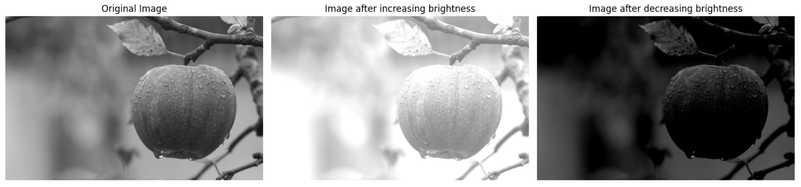
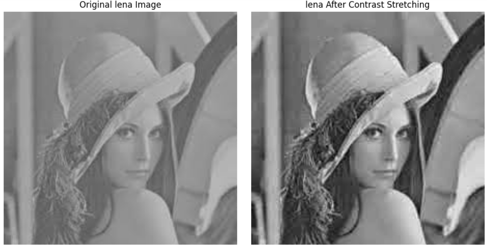
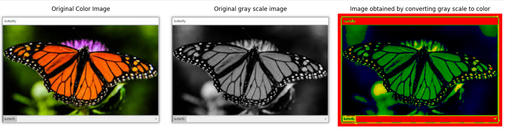
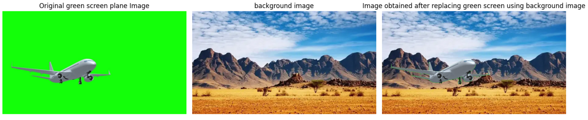

# Fundamentals of Image and Video Processing from Scratch

## Overview
This project implements fundamental image and video processing techniques **without relying on high-level image processing libraries** (except for basic file I/O). The goal is to build an understanding of how images and videos are represented and manipulated at a low level.

## Features
- **Image Reading & Writing**: Implemented functions to read an image file into an array and write an array back to an image file.
- **Brightness & Contrast Adjustment**: Manipulated pixel values to adjust brightness and contrast dynamically.

- **Grayscale Conversion**: Developed multiple methods for converting a color image to grayscale and analyzed their visual effects.

- **Pseudo-Color Mapping**: Applied pseudo-coloring techniques to enhance grayscale images.
- **Green-Screen Background Replacement**: Extracted and replaced green backgrounds in an image with a different background image.

- **Video Processing Pipeline**:
  - Read a video file and convert it into a sequence of images.
  - Reconstruct the video from the sequence of images.
- **Transition Effects**: Created a 1-second transition effect (fade, slide, etc.) between two images.
- **Optimized Memory Usage**: Used efficient data structures and optimized processing techniques for handling large image and video files.

