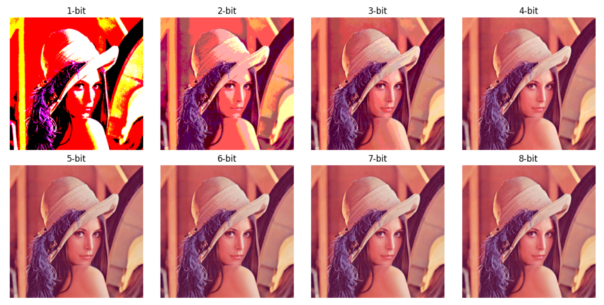
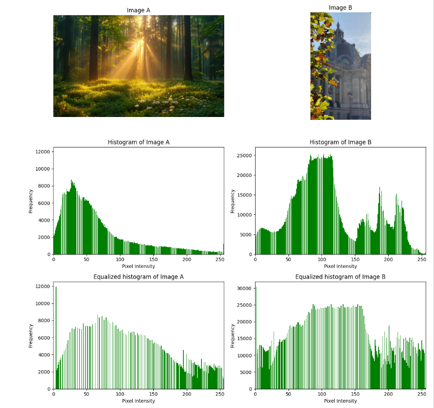

# Fundamental Image Processing: Quantization, Histogram Equalization, Cryptography, and Transformations

## Overview
This project implements essential image processing techniques **without relying on high-level image processing libraries** (except for basic file I/O). The goal is to develop a deeper understanding of image representation and manipulation by implementing core techniques from scratch.

## Features
- **Image Quantization**: Reduced image size by quantizing it into 1-8 bit representations and analyzed the visual effects.

- **Histogram Equalization**:
  - Implemented a custom `histequalize()` function to enhance image contrast.
  - Applied histogram equalization to grayscale and RGB images and analyzed their effects.

- **Cryptography in Images**:
  - Extracted hidden messages from images using **LSB (Least Significant Bit) Steganography**.
  - Developed `crypt()` and `decrypt()` functions to embed and extract messages from images.
- **Linear Piece-wise Transformations**:
  - Applied transformations to enhance image contrast.
  - Analyzed pixel intensity variations before and after transformations.
- **Optimized Performance**: Used vectorized implementations for efficient processing of large images.

