# Advanced Image Processing: Filtering, Edge Detection, Denoising, and Transformation Techniques

## Overview
This project explores various **image processing techniques**, including **filtering, edge detection, noise removal, morphological operations, and image transformations** to enhance and analyze images. All functions are implemented from scratch using **NumPy, Matplotlib, and OpenCV (basic functions)** to gain a deep understanding of image manipulation.

## Features
### **1. 2D Convolution & Filtering**
- Implemented a custom **conv2D()** function for image convolution.
- Applied **Mean, Median, Gaussian, and Bilateral filters** for image smoothing and noise reduction.
- Optimized Mean Filtering using a **fastMeanFilter()** implementation.

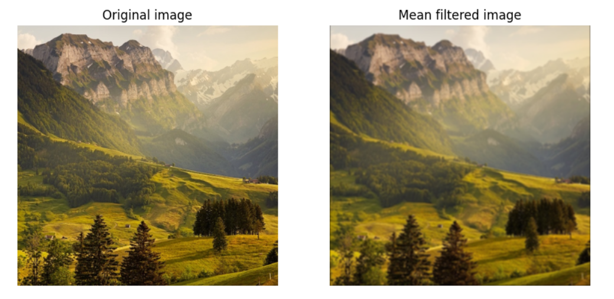
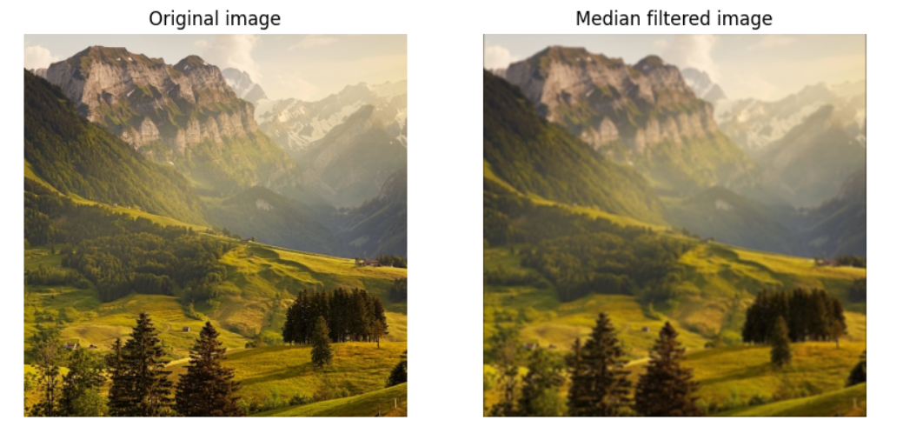
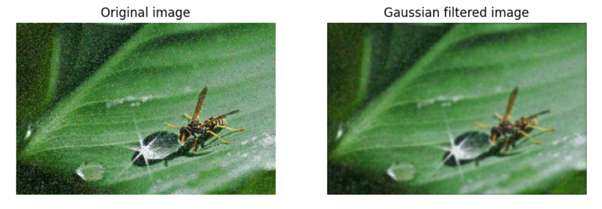
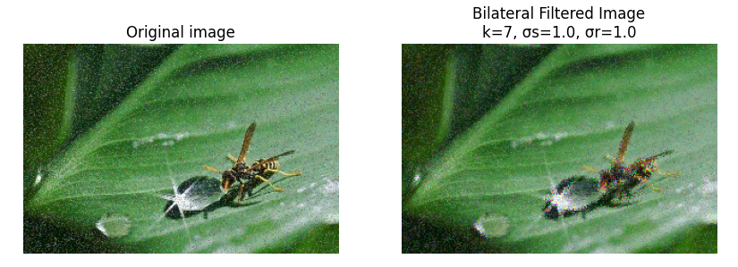

### **2. Edge Detection**
- Implemented **Sobel, Prewitt, Roberts, and Laplacian filters** to detect image gradients.
- Plotted edge maps and analyzed different methods for detecting boundaries.

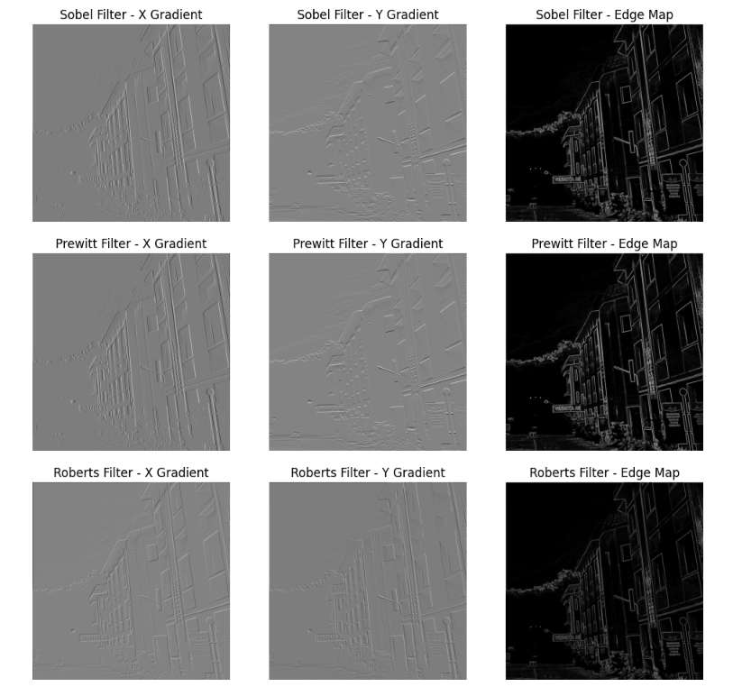
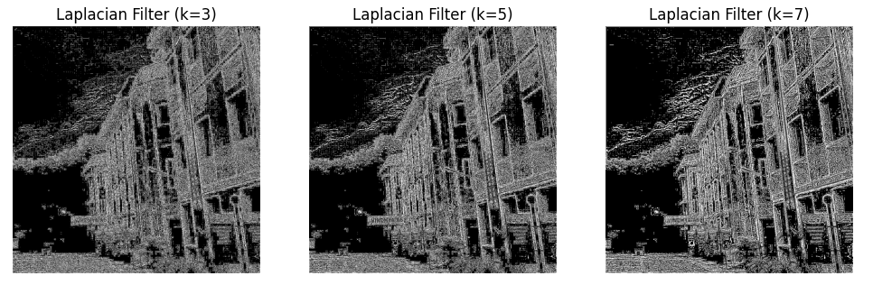

### **3. Image Sharpening**
- Developed an **Unsharp Masking** function to enhance fine details.
- Implemented a **High-Boost Filter** to amplify image features.
- Compared the effects of different sharpening techniques.

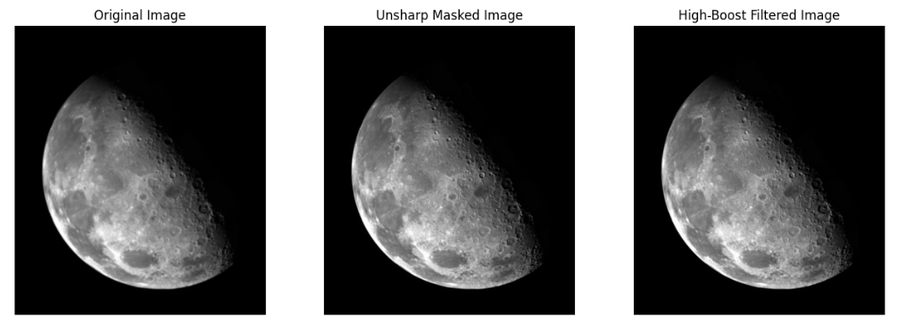

### **4. Noise Removal & Denoising**
- Analyzed different types of noise present in images.
- Applied **optimal filtering techniques** to restore corrupted images.
- Compared the efficiency of different noise removal methods.

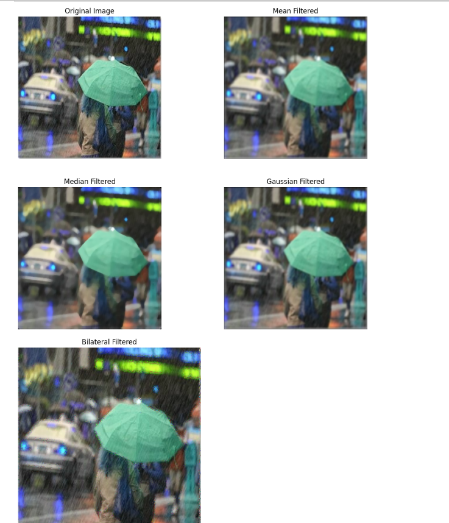
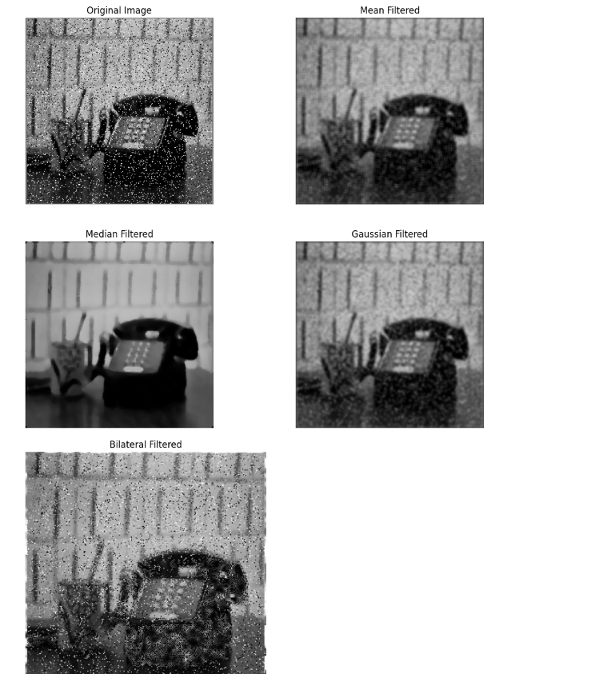

### **5. Morphological Operations**
- Designed a pipeline to **separate overlapping objects (e.g., coins) using morphological transformations**.
- Used different structuring elements for segmentation and object detection.

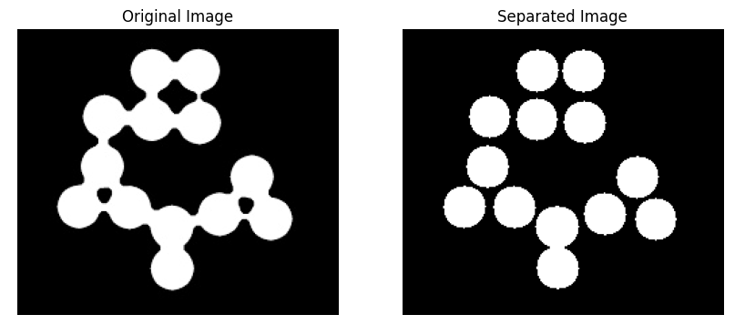

### **6. Signature Verification**
- Skeletonized handwritten signatures using a custom function.
- Analyzed the stability of skeletons across different signatures from the **CEDAR dataset**.

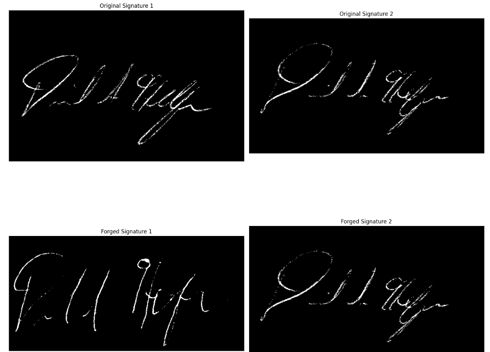

### **7. Medical Image Enhancement**
- Processed **nuclear whole-body bone scans** to highlight skeletal structures.
- Applied sharpening techniques to enhance medical imaging details.

### **8. Image Restoration & Transformation**
- Used filtering and denoising techniques to recover corrupted images.
- Applied various transformations to improve image clarity and structure.

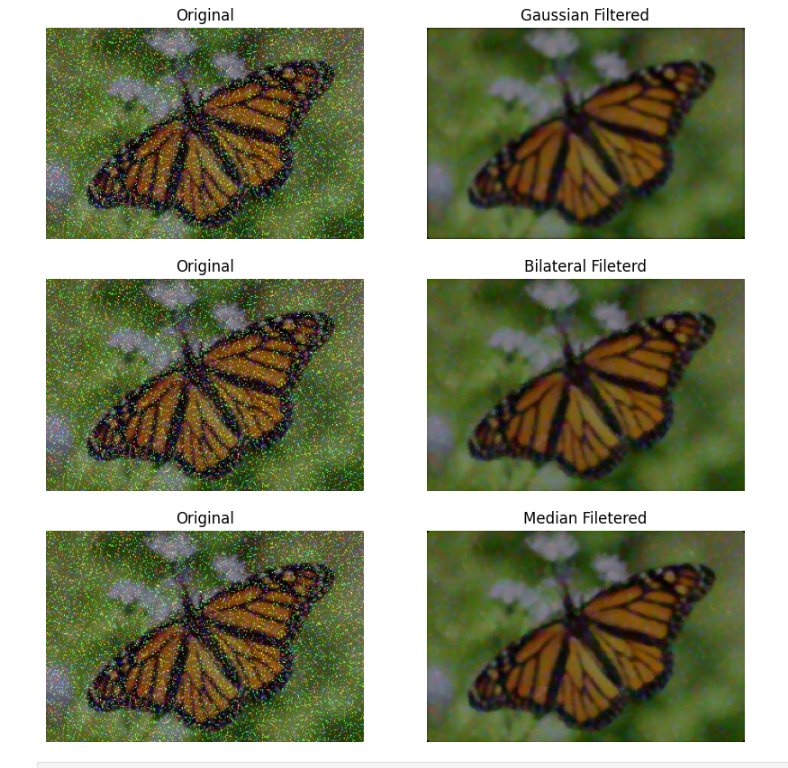

