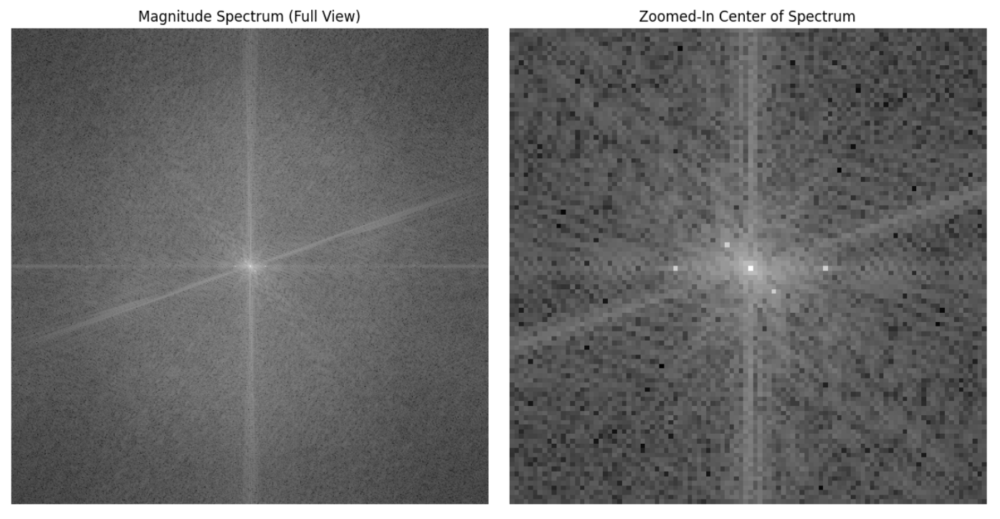
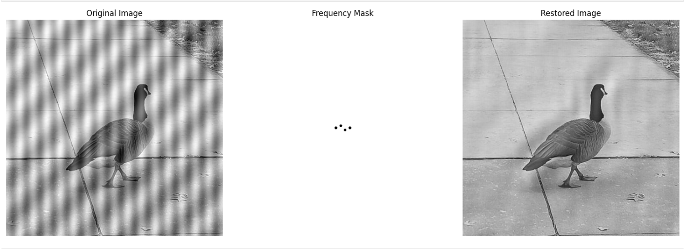
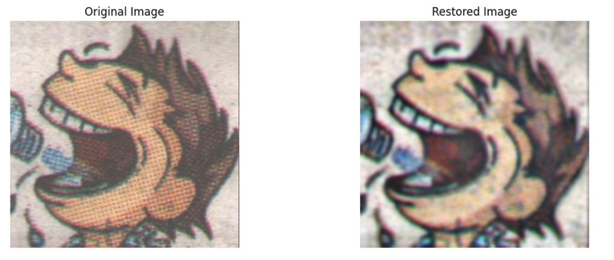
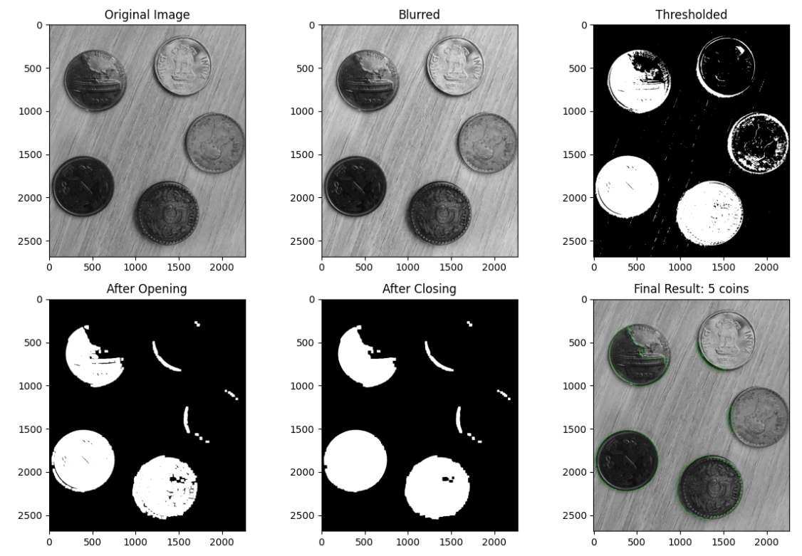
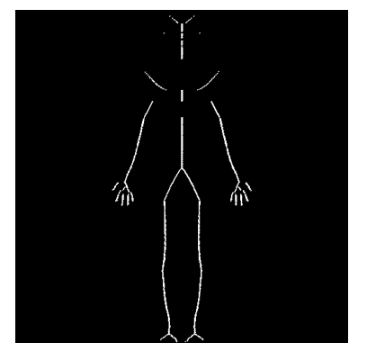
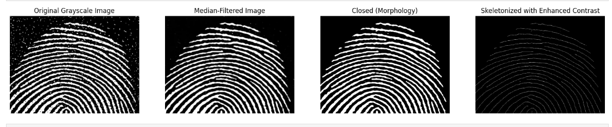

# Fourier Transform, Image Enhancement, and Morphological Processing in Digital Image Processing

## Overview
This project explores **Fourier Transform-based analysis, image restoration, noise removal, and morphological processing** for enhancing and analyzing images. Implemented **DFT, FFT, IFFT, super-resolution, fingerprint recognition, and object detection** using **NumPy, OpenCV (basic functions), and Matplotlib**.

## Features

### **1. Fourier Transform Analysis**
- **1D & 2D Discrete Fourier Transform (DFT):** Implemented custom **dft1()** and **dft2()** functions without using OpenCV’s FFT functions.
- **Fast Fourier Transform (FFT):** Developed **fft1()** and **fft2()** to optimize Fourier Transform computations.
- **Frequency Spectrum Analysis:** Analyzed frequency components of an **audio signal (1.wav)** and generated a frequency vs. magnitude plot.
- **Time Complexity Analysis:** Compared execution time for different array sizes `[128, 256, 512, 1024]` to showcase FFT’s efficiency.
- **Fourier Transform on Images:** Applied **2D-DFT and 2D-FFT** on mathematical and real-world image signals.
- **Phase and Magnitude Spectrum Modifications:** Reconstructed images after swapping **phase/magnitude components**.

### **2. Image Restoration & Super-Resolution**
- **Fingerprint Enhancement:** Denoised smudged and noisy **fingerprint images** for better recognition.
- **Super-Resolution using Frequency Filters:** Applied **Low-Pass and High-Pass filtering** to enhance image clarity.

- **Noise Removal & Artifact Removal:** Processed images such as `bird.png` and `cart.jpg` to remove unwanted artifacts.

### **3. Morphological Operations & Object Detection**
- **Coin Counting:** Used **morphological transformations (erosion, dilation, opening, closing)** and thresholding to detect and count coins.

- **Skeletonization of Human Bone Structures:** Applied **skeletonization algorithms** to analyze **human bone structure in `human.png`**.

- **Fingerprint Recognition & Edge Detection:** Combined **morphological operations, Gabor filters, thresholding, and skeletonization** to enhance `fingerprint2.png` for accurate recognition.
