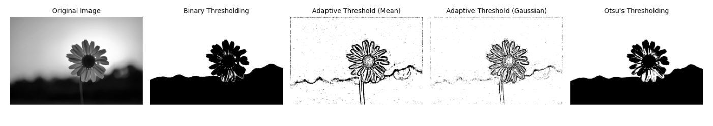
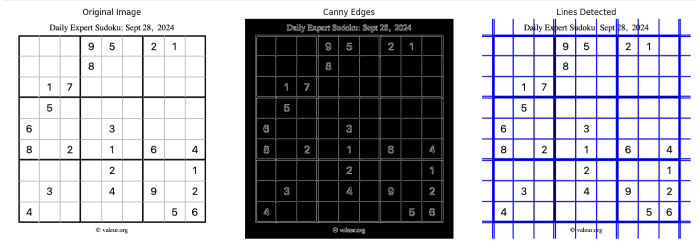
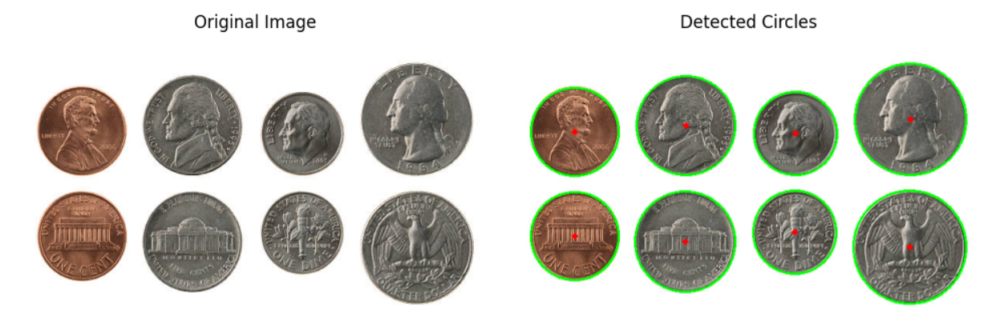
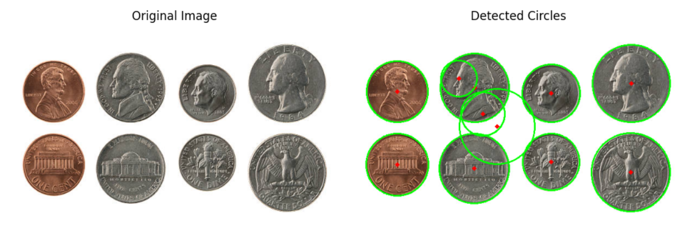
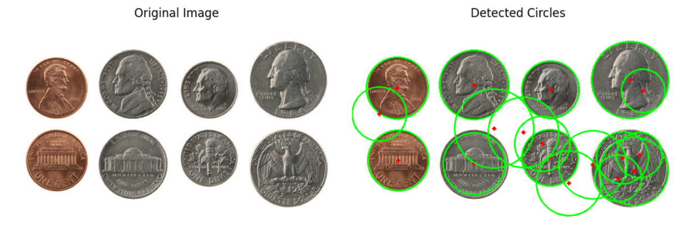
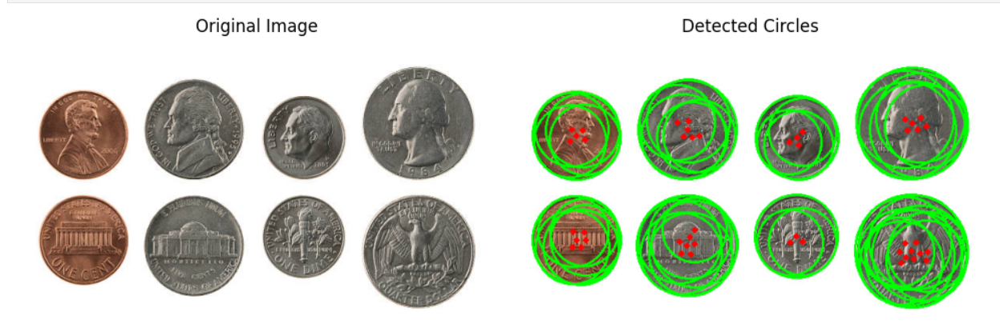
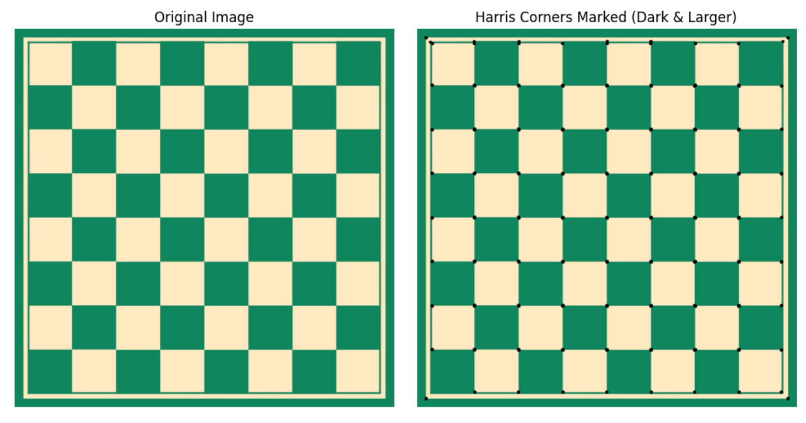

# Image Segmentation, Hough Transform, and Corner Detection in Digital Image Processing

## Overview
This project explores **image segmentation, Hough Transform for line and circle detection, and Harris Corner Detection** for feature extraction and analysis. It includes implementations of **thresholding techniques, edge detection, and corner detection** using **Python and OpenCV**, optimizing detection accuracy for real-world applications.

## Features

### **1. Image Segmentation**
- **Implemented Various Thresholding Techniques:**
  - **Binary Thresholding**
  - **Adaptive Thresholding**
  - **Otsu’s Thresholding**
- **Comparison and Analysis:**
  - Evaluated segmentation effectiveness by analyzing object boundaries and noise levels.
  - Displayed original vs. segmented images for clear comparison.

### **2. Hough Transform for Line and Circle Detection**
- **Hough Line Transform:**
  - Applied **Canny edge detection** before Hough Transform.
  - Detected straight lines in structured images such as roads, grids, and buildings.
  - Optimized line detection using different **threshold parameters**.
  

- **Hough Circle Transform:**
  - Applied preprocessing techniques like **smoothing** for improved circle detection.
  - Detected circular objects like **coins, wheels, and round signs**.
  - Experimented with **radius ranges and accumulator thresholds** for improved accuracy.

### **3. Harris Corner Detection**
- **Corner Detection Implementation:**
  - Developed a **Harris Corner Detection function** to identify distinct corners in an image.
  - Applied corner detection to structured images like **chessboards and buildings**.
  - Marked detected corners on images for better visualization.
- **Optimization and Parameter Tuning:**
  - Experimented with the sensitivity parameter **(k-value)**.
  - Observed effects of different k-values on feature detection.

### **4. Performance Analysis and Optimization**
- Compared **segmentation and feature detection** results using different preprocessing techniques.
- Adjusted **threshold parameters, radius ranges, and accumulator thresholds** to improve detection accuracy.